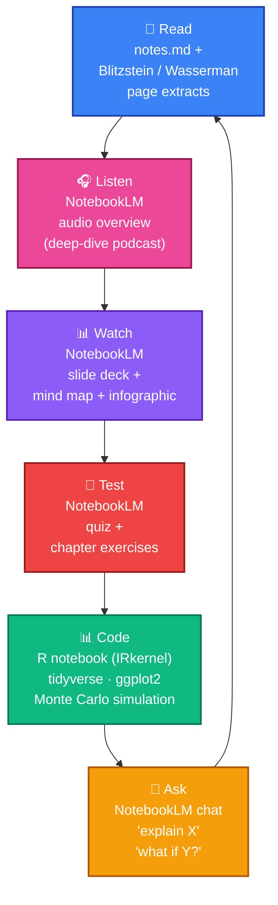

# Learn Statistics

> **Probability and statistics from first principles** — a 10-chapter self-study curriculum anchored on Blitzstein & Hwang's *Introduction to Probability* and Wasserman's *All of Statistics*, with Python and R notebooks, and a pre-built NotebookLM per chapter.

A sister curriculum to [`learn-linear-algebra`](https://github.com/prashantkul) (same author, same format). Each chapter ships with notes, 10 worked examples, 10 exercises, a **runnable R Jupyter notebook** (tidyverse + ggplot2 + simulation via IRkernel), and a **pre-built [NotebookLM](https://notebooklm.google.com/) notebook** with audio overview, quiz, mind map, slide deck, infographic, and chat.

## 👋 A note from me

Hi — I'm **Prashant Kulkarni**. I'm building this for the same reason I built the linear-algebra companion: 2026 is the year we stop reading math and start *talking to* it, *running it*, *asking it questions*, and *listening to it on a walk*.

Here is how I think learning stats should feel:

- **Rigorous but approachable.** High-school stats (mean, median, basic probability) is assumed; everything else — sample spaces, random variables, conditional probability, expectation, likelihoods, estimators, tests — is built up on the page where it first appears.
- **Interactive.** You should be able to *click, run, change a number, and watch what happens.* A probability distribution isn't a formula — it's a shape you can sample from ten thousand times and plot. Every chapter ships with a runnable **R notebook** precisely so you can poke the math.
- **Conversational.** Modern AI tutors (NotebookLM, Claude, ChatGPT) are absurdly good at *"explain the central limit theorem to me as if I were a chemist"* or *"give me one more example with smaller numbers."* That's a superpower previous generations of students never had. Use it shamelessly.
- **Honest about what's hard.** Measure-theoretic foundations, Borel σ-algebras, regular conditional distributions — when something is genuinely gnarly, we flag it honestly and give the intuition that gets you 95% of the way, not the formalism that gatekeeps.

That is the bet: take two of the best modern stats textbooks (Blitzstein's story-based probability and Wasserman's compact inference), wrap them in modern interactive tools (NotebookLM, Jupyter, Python, R), and learn stats the way 2026 actually lets you learn — together.

— *Prashant* · [kulkarniprashants@gmail.com](mailto:kulkarniprashants@gmail.com) · [@prashantkul on GitHub](https://github.com/prashantkul)

---

## 🎧 Start here

You don't need to clone anything. **[Open the NotebookLM index →](notebooks.md)**

Each public NotebookLM gives you the chapter's notes + textbook page extracts + AI-generated audio overview, quiz, mind map, slides, and infographic — and you can chat with the sources. Click *"Make a copy"* in NotebookLM to clone it to your own account and customize.

---

## Why probability and statistics, in the age of language models?

Because **every claim an LLM makes is a probability distribution**, and every evaluation of an LLM is a statistical test.

- **Language models are distributions over tokens.** Temperature, top-p, perplexity, calibration — these are all probability concepts. You can't reason about why a model hallucinates, or how to stop it, without fluency in conditional probability and likelihood.
- **Every benchmark is a hypothesis test.** "Is model A better than model B on MMLU?" is not a leaderboard question — it's a two-sample inference question with confidence intervals and multiple comparisons.
- **Every RAG pipeline is Bayesian retrieval.** "Given this query, what's the posterior distribution over relevant documents?" You can compose, debug, and extend retrieval systems only if you understand likelihood × prior.
- **Every alignment technique is inference.** RLHF, DPO, reward modeling — these are all parameter estimation under noisy human feedback. Wasserman's Ch 9 is the prerequisite for reading the DPO paper.

The frontier moves fast. The math underneath does not. **Investing here compounds for a lifetime.**

---

## How you'll learn here

This isn't a textbook PDF. It's a **multimodal learning loop** — each chapter gives you several different ways into the same ideas, and you cycle through whichever ones stick best for *your* brain.



### Two anchor books, one language

- **Blitzstein & Hwang — *Introduction to Probability*** drives Ch 1–5: first-principles, story-based, famously intuitive.
- **Wasserman — *All of Statistics*** drives Ch 6–10: compact, rigorous, one-volume inference (frequentist + Bayesian + nonparametric).
- **R / tidyverse / ggplot2** is the statistical lingua franca — what Blitzstein and Wasserman both speak natively, what most published stats papers use, and what every academic course expects. Every numerical answer in these chapters is verified against R's exact-arithmetic primitives.

---

## Chapter map

| # | Chapter | Sources (Blitzstein · Wasserman) | NotebookLM 🎧 | 📊 R notebook |
|---|---|---|---|---|
| 1 | [Foundations: sample spaces, counting, probability axioms, conditional probability](chapters/01-foundations/notes.md)<br/><sub>*"Probability is a measure on a sample space; everything else is bookkeeping."*</sub> | Ch 1–2 · Ch 1 | _soon_ | _soon_ |
| 2 | [Discrete random variables and their distributions](chapters/02-discrete-rvs/notes.md)<br/><sub>*"A random variable is a measurable function Ω → ℝ; its distribution is the pushforward."*</sub> | Ch 3–4 · — | _soon_ | _soon_ |
| 3 | [Expectation, variance, covariance, moments](chapters/03-expectation-variance/notes.md)<br/><sub>*"Linearity of expectation — the single most useful identity in probability."*</sub> | Ch 4–6 · — | _soon_ | _soon_ |
| 4 | [Continuous distributions, joint distributions, change of variables](chapters/04-continuous-and-joint/notes.md)<br/><sub>*"PDFs, Jacobians, the bivariate and multivariate normal. Matrices introduced here as bookkeeping; no LA background needed."*</sub> | Ch 5, 7–8 · Ch 2 | _soon_ | _soon_ |
| 5 | [Convergence and the limit theorems (LLN, CLT)](chapters/05-convergence-and-limit-theorems/notes.md)<br/><sub>*"Why sample means concentrate, and why they're approximately normal. The bridge to statistics."*</sub> | Ch 10 · Ch 5 | _soon_ | _soon_ |
| 6 | [Point estimation: MLE, method of moments, bias–variance](chapters/06-point-estimation/notes.md)<br/><sub>*"Given data, what's the best guess at the parameter? Two answers, both calculus."*</sub> | — · Ch 6, 9 | _soon_ | _soon_ |
| 7 | [Confidence intervals and the bootstrap](chapters/07-confidence-intervals-and-bootstrap/notes.md)<br/><sub>*"Quantifying uncertainty — analytically (normal-based CIs) and computationally (resampling)."*</sub> | — · Ch 7, 8 | _soon_ | _soon_ |
| 8 | [Hypothesis testing and p-values](chapters/08-hypothesis-testing/notes.md)<br/><sub>*"p-values, power, Wald/LRT/score tests, multiple comparisons — and when not to trust any of it."*</sub> | — · Ch 10 | _soon_ | _soon_ |
| 9 | [Linear regression (LA-optional sidebar)](chapters/09-linear-regression/notes.md)<br/><sub>*"Least squares = maximum likelihood under Gaussian noise. Derived algebraically; LA sidebar for the geometric picture."*</sub> | — · Ch 13 | _soon_ | _soon_ |
| 10 | [Bayesian inference: priors, posteriors, MCMC preview](chapters/10-bayesian-inference/notes.md)<br/><sub>*"Prior × likelihood, normalized. Conjugate pairs analytically; everything else via `rstanarm` / `brms`."*</sub> | Ch 9 · Ch 11 | _soon_ | _soon_ |

**Running the R notebooks**

Install the R kernel for Jupyter once:

```R
# From an R console:
install.packages(c("IRkernel", "tidyverse", "ggplot2"))
IRkernel::installspec()
```

Then start Jupyter from the repo root and open a chapter's notebook:

```bash
uv sync              # installs pypdf/pyyaml/jupyterlab for the server
uv run jupyter lab   # pick the "R" kernel when the notebook opens
```

Full details in [CONTRIBUTING.md](CONTRIBUTING.md).

Every chapter's text also lives in this repo under [`chapters/`](chapters/) — read it directly on GitHub.

## Audience and depth

Self-study. Prerequisites:

- **Single- and multivariable calculus** (limits, derivatives, integrals, partial derivatives, basic multi-integrals).
- **High-school statistics** — mean, median, variance (loosely), reading a histogram, basic fair-coin/fair-die probability. We don't re-teach these; we build on them.
- **No linear algebra assumed.** Matrices are introduced just-in-time as bookkeeping from Ch 3 onward. Only Ch 9 (linear regression) has an *optional* LA sidebar for readers who've done the sister [`learn-linear-algebra`](../learn-linear-algebra) curriculum.

Intuition first, rigor where it earns its keep; no gatekeeping prerequisites.

## Source texts

This curriculum is anchored on (and respects the copyrights of) two excellent textbooks. The page extracts in the NotebookLM notebooks fall under fair-use educational commentary; the books themselves are not redistributed.

- **Joseph K. Blitzstein and Jessica Hwang — *Introduction to Probability*, 2nd ed.** (CRC Press, 2019). A free companion PDF is linked from the authors' Stat 110 site: <https://projects.iq.harvard.edu/stat110/home>.
- **Larry Wasserman — *All of Statistics: A Concise Course in Statistical Inference*** (Springer, 2004). Available via Springer (check your institutional access).

If you want a deeper read, get your own copies of these books — they're worth it.

## License

Tutorial material (notes, worked examples, exercises, code, scripts) is licensed under the MIT License — see [LICENSE](LICENSE).

## Contributing

Want to improve an explanation, add a worked example, fix an exercise? See [CONTRIBUTING.md](CONTRIBUTING.md) for the dev setup (uv, R kernel, PDF extraction, NotebookLM publishing pipeline) and how to send a PR.
